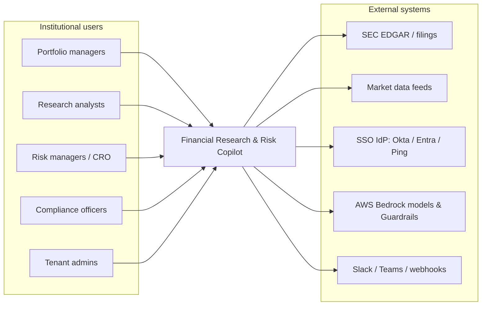
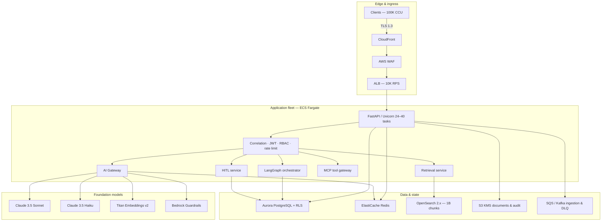
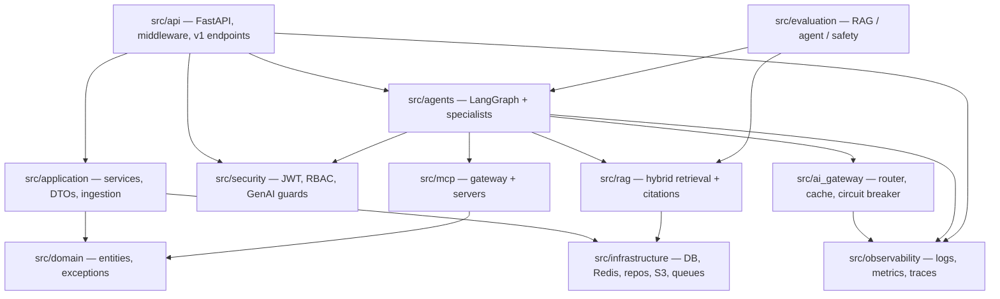
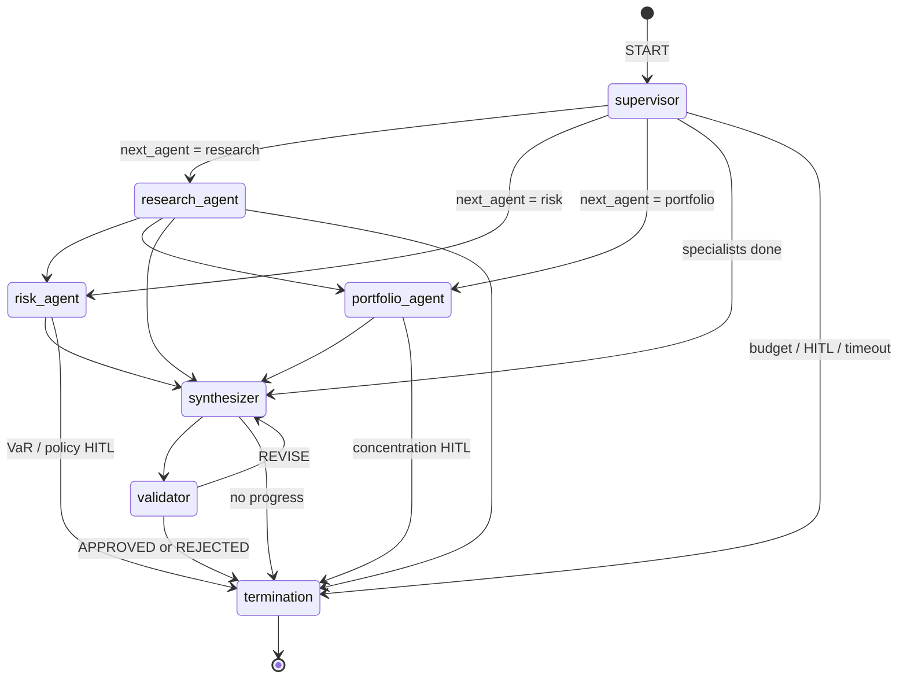
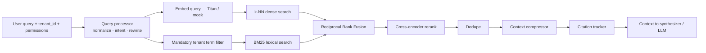
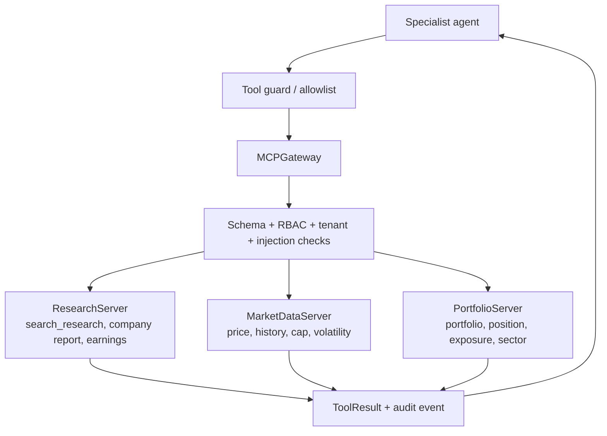
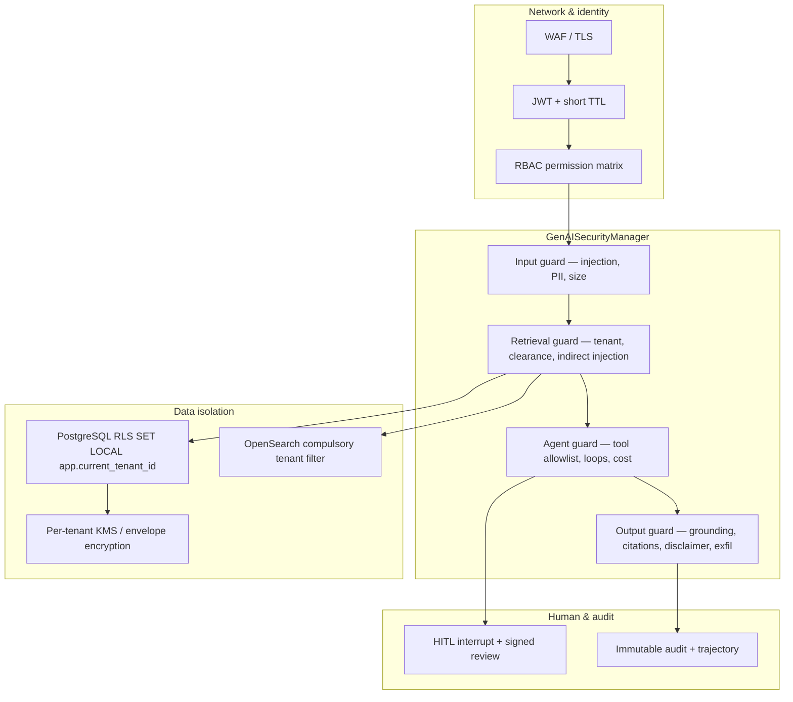
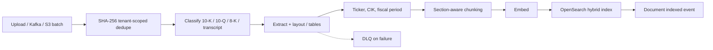
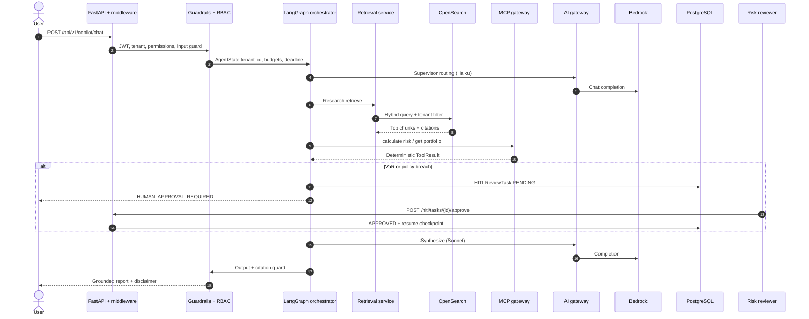
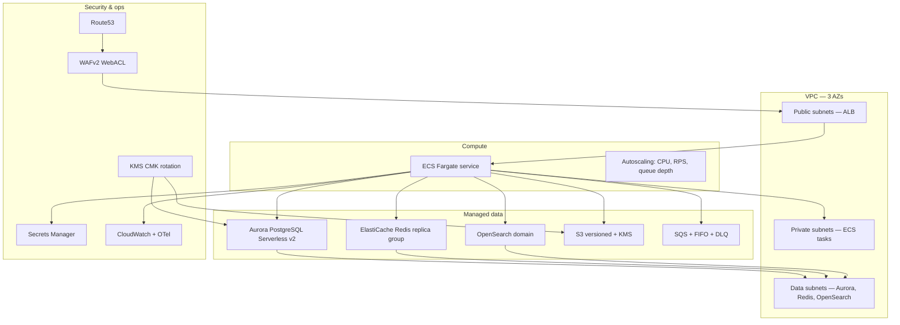

# System architecture — Enterprise Financial Research & Risk Copilot

These diagrams describe the **intended production architecture** and the **code modules that implement it**. Local development substitutes SQLite, mock LLMs, in-memory LangGraph checkpoints, and optional Docker Compose for Postgres, Redis, and OpenSearch.

---

## 1. System context

Who uses the platform and which external systems it talks to.

---

## 2. Container / runtime topology

Logical services as deployed on AWS (ECS FastAPI is the application process that hosts API, agents, RAG client, MCP gateway, and AI gateway in-process).

---

## 3. Application module map (code)

How `src/` packages relate. HTTP never talks to Bedrock or OpenSearch except through these modules.

---

## 4. LangGraph agent graph

Compiled in `src/agents/orchestrator.py`. Conditional edges after every specialist use `_route_after_step`. Any node may divert to `termination` when a guard fires.

**Termination reasons** (`TerminationReason`): `SUCCESS`, `MAX_ITERATIONS`, `TIMEOUT`, `TOKEN_BUDGET_EXCEEDED`, `COST_LIMIT_EXCEEDED`, `NO_PROGRESS`, `TOOL_FAILURE_LIMIT`, `HUMAN_APPROVAL_REQUIRED`, `UNRECOVERABLE_ERROR`.

---

## 5. Hybrid RAG pipeline

Implemented by `RetrievalService` (`src/rag/retrieval_service.py`). Tenant mismatch on index or query is a hard failure.

OpenSearch production sizing intent: ~24 data nodes, ~200 primary shards, ~1B chunks, routing key `tenant_{tenant_id}`.

---

## 6. MCP tool perimeter

Agents never receive unrestricted network access. `MCPGateway` discovers tools, checks allowlists, validates Pydantic schemas, enforces tenant RPM and timeouts.

---

## 7. Defense in depth

---

## 8. Document ingestion

Code: `src/application/ingestion/pipeline.py`, `src/workers/ingestion_worker.py`, `src/events/document_events.py`.

---

## 9. Copilot sequence (intended end-to-end)

This is the target path for `POST /api/v1/copilot/chat`. Some HTTP handlers are still preview stubs; the modules below already exist.

---

## 10. AWS production (Terraform)

Modules under `terraform/modules/`, environments `dev` / `staging` / `prod`.

---

## 11. Local vs production mapping

| Concern | Local | Production |
|---|---|---|
| API | `uvicorn src.api.main:app` | ECS Fargate behind ALB |
| Database | SQLite `financial_copilot_dev.db` or Compose Postgres 16 | Aurora PostgreSQL Multi-AZ + RLS |
| Cache | Optional Redis / in-process | ElastiCache Redis |
| Search | Compose OpenSearch or in-memory test store | OpenSearch 24-node class cluster |
| LLM | `MockLLMProvider` | Bedrock Claude + Titan + Guardrails |
| Checkpointer | `InMemorySaver` | PostgreSQL checkpointer |
| Objects | Local filesystem | S3 + KMS |
| Queue | Local in-process queue | SQS / MSK |
| Secrets | `.env` dev key | Secrets Manager |

---

## 12. Scale numbers used in design

| Layer | Planning number |
|---|---|
| API tasks | 24–40 FastAPI containers, ~600 safe RPS each |
| AI absorber | ~35% Redis semantic cache (cosine > 0.96) |
| Chunk storage | ~12 KB/chunk → ~12 TB primary, ~32 TB allocated with replica + watermark |
| OpenSearch shards | ~200 primaries, ~60 GB/shard target |
| SLO | 99.99% availability; conversational TTFT target < 800 ms |
