# Enterprise Financial Research & Risk Copilot — System Architecture

## 1. Architectural Overview & Design Principles

The Enterprise Financial Research & Risk Copilot platform is architected around six core foundational principles:
1. **Strict Multi-Tenant Isolation**: Tenant boundaries are enforced cryptographically, relationally (PostgreSQL Row-Level Security), and at the vector index routing level. Cross-tenant leakage is architecturally prohibited.
2. **Decoupled Asynchronous Processing**: High-throughput document ingestion and long-running agent workflows are asynchronous, event-driven, and decoupled via Apache Kafka and durable state machines.
3. **Centralized AI Gateway Pattern**: Raw LLM provider calls are strictly forbidden in application code; all model requests route through a resilient AI Gateway providing semantic caching, token bucket rate limiting, circuit breaking, guardrail enforcement, and token accounting.
4. **Controlled Tool Invocation via MCP**: Agent access to enterprise tools (SEC filings, live market tickers, portfolio risk models) is mediated via standardized Model Context Protocol (MCP) micro-gateways in isolated security boundaries.
5. **Durable Agent State Machine**: LangGraph state machine execution checkpoints state at every node, enabling seamless Human-In-The-Loop (HITL) interrupt and resume across distributed container fleets.
6. **Defense in Depth**: Zero Trust networking, WAF, mTLS between internal services, envelope encryption with KMS Customer Managed Keys, and immutable WORM audit logs.

---

## 2. End-to-End System Architecture Diagram

```mermaid
flowchart TD
    %% CLIENT & EDGE TIER
    subgraph EdgeTier["1. Edge & Ingress Tier"]
        Users["100,000 Concurrent Users / Institutional Clients"] --> CloudFront["AWS CloudFront CDN"]
        CloudFront --> AWS_WAF["AWS WAF (Rate Limiting, DDoS, OWASP Top 10)"]
    end

    %% API GATEWAY & LOAD BALANCING
    subgraph IngressTier["2. Ingress & Load Balancing"]
        AWS_WAF --> APIGateway["AWS API Gateway / ALB (10,000 RPS Target)"]
        APIGateway --> IstioIngress["Envoy / Service Mesh Ingress Controller"]
    end

    %% APPLICATION SERVICES
    subgraph AppTier["3. Application Services (FastAPI Fleet on ECS/EKS)"]
        IstioIngress --> AuthMW["Auth & Multi-Tenant Context Middleware"]
        AuthMW --> RateLimiter["Redis Token-Bucket Rate Limiter"]
        RateLimiter --> AppServices["FastAPI Core Application Services"]
        
        AppServices --> CopilotRouter["Copilot Router & Streaming (SSE/WS)"]
        AppServices --> DocumentRouter["Document Catalog & Search Router"]
        AppServices --> RiskRouter["Portfolio Risk Management Router"]
        AppServices --> HITLRouter["HITL Task Management Router"]
    end

    %% AI GATEWAY
    subgraph AIGatewayTier["4. Dedicated AI Gateway"]
        CopilotRouter --> AIGateway["Centralized AI Gateway Service"]
        AIGateway --> SemanticCache["Redis Semantic Cache (>0.96 Cosine Sim)"]
        AIGateway --> GuardrailFilter["Bedrock Guardrails & Prompt Injection Filter"]
        AIGateway --> CircuitBreaker["Resilience Engine (Circuit Breakers & Retries)"]
        AIGateway --> CostTracker["FinOps Token Counting & Cost Attribution"]
    end

    %% AGENT RUNTIME
    subgraph AgentRuntimeTier["5. Stateful Agent Runtime (LangGraph)"]
        CopilotRouter --> LangGraphRuntime["LangGraph Multi-Agent Orchestrator"]
        LangGraphRuntime --> IntentRouterNode["Supervisor / Intent Router Node (Claude Haiku)"]
        IntentRouterNode --> ResearchAgentNode["Financial Research Agent Node"]
        IntentRouterNode --> RiskAgentNode["Portfolio Risk & VaR Agent Node"]
        IntentRouterNode --> ComplianceAgentNode["Regulatory Compliance Agent Node"]
        
        ResearchAgentNode --> SynthesisNode["Synthesis Node (Claude 3.5 Sonnet)"]
        RiskAgentNode --> SynthesisNode
        ComplianceAgentNode --> SynthesisNode
        
        SynthesisNode --> HITLGateNode["HITL Interruption Gate Node"]
        HITLGateNode --> Checkpointer["Durable State Checkpointer (Postgres/Redis)"]
    end

    %% RETRIEVAL SERVICE
    subgraph RetrievalTier["6. Dedicated Retrieval Service"]
        ResearchAgentNode --> RetrievalService["Scalable Hybrid Retrieval Service"]
        RetrievalService --> OpenSearchCluster["Amazon OpenSearch 2.x Cluster (24 Data Nodes, 1B+ Chunks)"]
        OpenSearchCluster --> BM25Engine["BM25 Lexical Inverted Index"]
        OpenSearchCluster --> HNSWEngine["k-NN HNSW Vector Index (FAISS/Titan 1536d)"]
        RetrievalService --> RRFusion["Reciprocal Rank Fusion (RRF) & Reranker"]
    end

    %% MCP GATEWAY & TOOLS
    subgraph MCPTier["7. MCP Gateway & Enterprise Tools"]
        LangGraphRuntime --> MCPGateway["Model Context Protocol (MCP) Gateway"]
        MCPGateway --> SEC_MCP["SEC EDGAR MCP Server (10-K, 10-Q, XBRL)"]
        MCPGateway --> Market_MCP["Live Market Data MCP Server (Quotes, Yields)"]
        MCPGateway --> Risk_MCP["Quantitative Risk MCP Server (Monte Carlo, Greeks)"]
    end

    %% DATABASES & PERSISTENCE
    subgraph DataTier["8. Transactional Databases & Caching"]
        AppServices --> RDSProxy["Amazon RDS Proxy (Connection Pooler)"]
        RDSProxy --> AuroraPostgres["Amazon Aurora PostgreSQL Multi-AZ (Row-Level Security)"]
        Checkpointer --> AuroraPostgres
        AppServices --> ElastiCacheCluster["Amazon ElastiCache Redis Cluster (Sessions, State, Locks)"]
        SemanticCache --> ElastiCacheCluster
        RateLimiter --> ElastiCacheCluster
    end

    %% INGESTION & DOCUMENT PROCESSING PIPELINE
    subgraph IngestionPipeline["9. Ingestion & Document Processing"]
        ExternalDocs["SEC EDGAR / Uploaded Filings"] --> S3Raw["Amazon S3 Raw Documents (WORM / SSE-KMS)"]
        S3Raw --> KafkaMSK["Amazon MSK (Apache Kafka) / SQS Event Bus"]
        KafkaMSK --> IngestionWorkers["Document Processing Worker Fleet (ECS)"]
        IngestionWorkers --> LayoutParser["Financial Table & Layout Parser"]
        LayoutParser --> SemanticChunker["SEC Section & Semantic Chunker"]
        SemanticChunker --> EmbeddingWorker["Embedding Generator (Titan Text v2)"]
        EmbeddingWorker --> RetrievalService
    end

    %% LLM PROVIDERS
    subgraph LLMProviders["10. Managed LLM Providers"]
        CircuitBreaker --> BedrockSonnet["AWS Bedrock: Claude 3.5 Sonnet v2 (Deep Reasoning)"]
        CircuitBreaker --> BedrockHaiku["AWS Bedrock: Claude 3.5 Haiku (Fast Triage/Router)"]
        EmbeddingWorker --> BedrockTitan["AWS Bedrock: Titan Text Embeddings v2"]
        GuardrailFilter --> BedrockGuardrails["AWS Bedrock Guardrails Service"]
    end

    %% OBSERVABILITY & AUDIT
    subgraph ObservabilityTier["11. Observability, Telemetry & Audit"]
        AppServices -.-> OTelCollector["OpenTelemetry Collector Fleet"]
        LangGraphRuntime -.-> OTelCollector
        AIGateway -.-> OTelCollector
        RetrievalService -.-> OTelCollector
        
        OTelCollector --> Prometheus["Prometheus / Amazon Managed Prometheus"]
        OTelCollector --> CloudWatch["Amazon CloudWatch Logs & Metrics"]
        OTelCollector --> Jaeger["Jaeger / AWS X-Ray (Distributed Traces)"]
        AppServices --> S3Audit["S3 Immutable Audit Bucket (Object Lock WORM)"]
    end
```

---

## 3. Component Architectural Responsibilities

### 3.1 Edge & Ingress Tier
- **AWS CloudFront**: Global Content Delivery Network (CDN) terminating SSL/TLS at the edge, caching static assets, and serving as the global anycast entry point.
- **AWS WAF**: Web Application Firewall enforcing rate-based rules (protecting against Layer 7 DDoS), mitigating OWASP Top 10 exploits, preventing SQL injection, and inspecting geographic IP anomalies.
- **AWS Application Load Balancer (ALB)**: Horizontally distributes 10,000 API requests/second across the ECS FastAPI fleet with round-robin balancing, health checks (`GET /health/ready`), and automatic target deregistration.

### 3.2 Application Services Tier (FastAPI)
- **Multi-Tenant Context Middleware**: Extracts user identity and tenant claims from cryptographically verified JWTs or API keys. Injects `tenant_id` into Python `contextvars` and executes `SET LOCAL app.current_tenant_id` upon acquiring an Aurora PostgreSQL connection.
- **Redis Token-Bucket Rate Limiter**: High-speed rate limiting running atomic Lua scripts on ElastiCache Redis, protecting downstream AI and database layers from burst exhaustion.
- **Async API Endpoints**: Stateless, non-blocking asynchronous request handlers built with FastAPI and `uvloop`.

### 3.3 Centralized AI Gateway
- **Abstract Provider Interface**: Decouples business logic from concrete cloud foundation model providers.
- **Semantic Caching**: Intercepts repetitive market queries by computing cosine similarity against previously answered query embeddings in Redis. If similarity exceeds $0.96$, returns validated response immediately, bypassing LLM invocation.
- **Resilience Engine**: Implements exponential backoff with jitter, circuit breaking (opening after 5 consecutive failures or P99 latency $> 10\text{s}$), and automatic failover to fallback models.
- **Bedrock Guardrails Pipeline**: Applies PII masking, toxicity blocking, and financial disclaimer enforcement before and after model generation.
- **FinOps Accounting**: Records prompt, completion, and embedding tokens per tenant for real-time cost attribution and spend limit enforcement.

### 3.4 Stateful Agent Runtime (LangGraph)
- **Supervisor & Intent Routing**: Uses fast Claude 3.5 Haiku to triage user questions into Research, Risk, Portfolio, or Hybrid execution branches.
- **Specialized Worker Nodes**:
  - *Research Agent*: Conducts multi-query generation and queries the Retrieval Service.
  - *Risk Agent*: Calculates quantitative risk parameters and runs macro stress scenarios.
  - *Synthesis Agent*: Uses Claude 3.5 Sonnet to draft institutional financial memos with inline citations.
- **HITL Interruption Gate**: Evaluates risk and compliance triggers. If breached, invokes LangGraph `interrupt()`, snapshots state to Aurora PostgreSQL, and dispatches a review task.

### 3.5 Dedicated Scalable Retrieval Service
- **Cluster Architecture**: Amazon OpenSearch Service 2.x cluster with 24 Data Nodes (`r6g.4xlarge.search`), 3 Dedicated Cluster Managers, and 200 primary shards holding 1B+ chunks.
- **Hybrid Search Engine**: Fuses BM25 lexical search with k-NN HNSW dense vector search using Reciprocal Rank Fusion (RRF).
- **Tenant Shard Routing**: Appends `routing=tenant_{tenant_id}` and term filters on all queries to guarantee physical and logical isolation.

### 3.6 MCP Gateway & Enterprise Tools
- **Model Context Protocol (MCP)**: Microservices communicating via JSON-RPC 2.0 to provide standard tool interfaces.
- **Sandboxed Tool Isolation**: Prevents LLMs from executing arbitrary code or querying unauthorized internal systems.

### 3.7 Transactional Storage & Ingestion Pipeline
- **Amazon Aurora PostgreSQL**: Multi-AZ cluster with Aurora Auto Scaling read replicas. Row-Level Security (RLS) guarantees database-level tenant isolation.
- **Amazon RDS Proxy**: Connection pooler mitigating connection spikes across hundreds of container tasks.
- **Amazon MSK (Apache Kafka)**: High-throughput distributed event bus streaming document ingestion jobs and indexing events.
- **Ingestion Workers**: Parse financial tables into Markdown/HTML, perform SEC Item section chunking, generate embeddings via Bedrock Titan, and bulk index into OpenSearch.

### 3.8 Observability & Compliance Tier
- **OpenTelemetry (OTel)**: Distributed tracing propagating W3C TraceContext headers across HTTP, Kafka, and agent nodes.
- **Prometheus & CloudWatch**: Metrics collection for API RPS, latencies, cache hit ratios, and token usage.
- **S3 Object Lock (WORM)**: Write-Once-Read-Many regulatory storage for SEC Rule 17a-4 and FINRA compliance audit trails.
