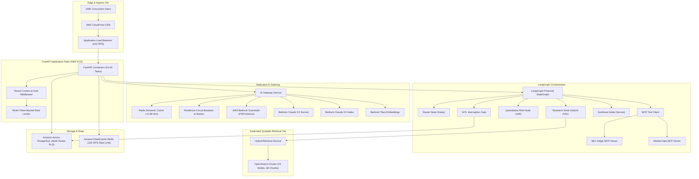

# Enterprise Financial Research & Risk Copilot - System Architecture & Sizing Document

## 1. Executive Summary & Design Targets

The Enterprise Financial Research & Risk Copilot is an institutional-grade platform engineered to serve global investment banks, hedge funds, asset managers, and risk departments. It delivers SEC filing intelligence, earnings call extraction, quantitative portfolio risk analytics (Value-at-Risk, stress testing), and compliance monitoring.

### Target Specifications
- **Registered Users**: 10,000,000 (10M)
- **Monthly Active Users (MAU)**: 2,000,000 (2M)
- **Peak Concurrent Users (CCU)**: 100,000 (100K)
- **Peak API Requests/Second**: 10,000 RPS
- **Peak AI Requests/Second**: 500 – 1,000 req/s
- **Document Corpus**: 100,000,000+ (100M+) SEC filings, transcripts, and research memos
- **Searchable Chunks**: 1,000,000,000+ (1B+) vector and text chunks
- **Availability Target**: 99.99% (maximum allowed downtime: ~52.6 minutes/year)

---

## 2. Quantitative Capacity & Sizing Model

### 2.1 Storage & Vector Sizing (1 Billion Searchable Chunks)
1. **Chunk Payload Breakdown**:
   - Average text size per chunk: 500 tokens (~2,000 characters / 2 KB).
   - Dense vector embedding: 1,536 dimensions (float32 = 6,144 bytes).
   - Metadata (Tenant ID, Doc ID, Ticker, Section, Fiscal Period, Timestamp): ~1.8 KB.
   - Inverted BM25 index + HNSW graph overhead: ~2 KB per chunk.
   - **Total index storage per chunk**: ~12 KB.
2. **Total Storage Capacity**:
   $$\text{Primary Data} = 10^9 \text{ chunks} \times 12 \text{ KB} = 12 \text{ TB}$$
   $$\text{With 1 Primary + 1 Replica} = 12 \text{ TB} \times 2 = 24 \text{ TB}$$
   With 25% OpenSearch watermark buffer and growth headroom:
   $$\text{Allocated NVMe / gp3 EBS Storage} \approx 32 \text{ TB}$$
3. **OpenSearch Cluster Sizing**:
   - Shard distribution: 200 primary shards (each ~60 GB, well within the 30–65 GB/shard recommendation).
   - Data nodes: 24 `r6g.4xlarge.search` nodes (16 vCPU, 128 GiB RAM each) across 3 AWS Availability Zones.
   - Dedicated cluster managers: 3 `c6g.xlarge.search` nodes.

### 2.2 API Tier Sizing (10,000 API Requests/Second)
- **Traffic Pattern**:
  - 85% read/status/metadata queries (P95 < 25 ms, served via Redis cache or async PostgreSQL pool).
  - 10% submission/mutation queries (P95 < 80 ms).
  - 5% initiated AI queries (500–1,000 AI req/s).
- **FastAPI Throughput**:
  - FastAPI on Uvicorn with `uvloop` achieves ~1,000 non-blocking I/O RPS per 2-vCPU container.
  - Base container capacity:
    $$\text{Containers Required} = \frac{10,000 \text{ RPS}}{600 \text{ conservative safe RPS/task}} \approx 17 \text{ tasks}$$
  - Production deployment: 24 to 40 tasks on AWS ECS (Fargate or EC2) behind an Application Load Balancer with dynamic autoscaling based on Target Tracking (CPU 60% and RequestCountPerTarget 500).

### 2.3 AI Gateway & LLM Throughput (500–1,000 AI Requests/Second)
Directly transmitting 1,000 req/s to foundation models would cause massive rate-limit throttling and extreme cost. The platform employs a **4-tier traffic absorber**:
1. **Tier 0 - Exact & Semantic Cache (Redis)**:
   - Intercepts identical or semantically equivalent questions (cosine similarity $> 0.96$).
   - Expected hit rate: ~35%. Absorbs 350 req/s.
2. **Tier 1 - Fast Triage & Router (AWS Bedrock Claude 3.5 Haiku)**:
   - Processes 70% of cache misses (intent routing, summary extraction).
   - Fast token generation (~180 ms TTFT).
3. **Tier 2 - Deep Reasoning Agent (AWS Bedrock Claude 3.5 Sonnet)**:
   - Complex financial synthesis, multi-step filing cross-referencing.
4. **Tier 3 - Async Queues (Kafka / Background Workers)**:
   - Long-form deep research memos execute asynchronously, streaming progress via Server-Sent Events (SSE) or WebSockets.

---

## 3. Architecture Topology



---

## 4. Multi-Tenant Isolation & Security Strategy

1. **Database Multi-Tenancy (Row-Level Security)**:
   - Every tenant is assigned a distinct UUID `tenant_id`.
   - PostgreSQL Row-Level Security (RLS) is enforced on all tables:
     ```sql
     ALTER TABLE financial_documents ENABLE ROW LEVEL SECURITY;
     CREATE POLICY tenant_isolation_policy ON financial_documents
     USING (tenant_id = current_setting('app.current_tenant_id')::uuid);
     ```
   - Database connections check out of the pool and execute `SET LOCAL app.current_tenant_id = '...'` within transactions.
2. **OpenSearch Tenant Partitioning**:
   - Multi-tenant routing key `tenant_{tenant_id}` ensures queries hit the shard partition dedicated to that tenant.
   - Compulsory query filter `{"term": {"tenant_id": tenant_id}}` prevents any cross-tenant data leakage.
3. **No Hardcoded Secrets**:
   - All credentials loaded dynamically via environment variables / AWS Secrets Manager.
