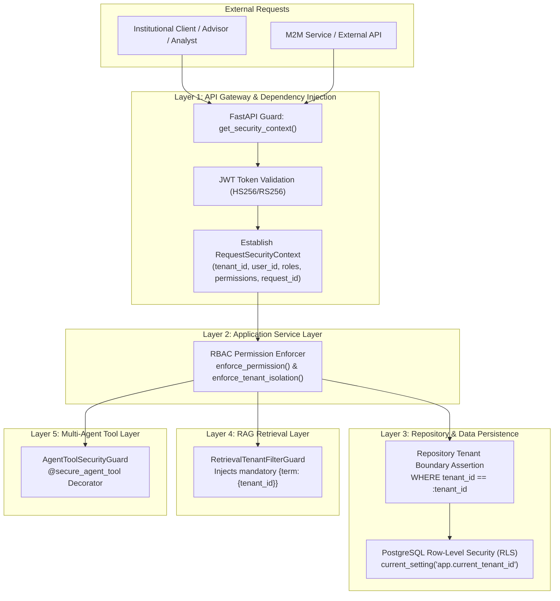

# Enterprise Identity, Authentication, Authorization, and Multi-Tenancy Architecture

## 1. Executive Summary & Zero-Trust Security Posture

The **Enterprise Financial Research & Risk Copilot** is designed for institutional deployment handling multi-billion-dollar portfolios and sensitive market intelligence. In adherence to strict regulatory mandates (SEC Rule 17a-4, FINRA Books and Records, and SOC-2 Type II), the platform implements a **Zero-Trust, Defense-in-Depth security architecture**.

Under this paradigm:
1. **Never Trust, Always Verify:** Every incoming request must establish verified identity, tenant association, and granular permissions.
2. **Absolute Tenant Segregation:** A user or agent belonging to Tenant A must **never** read, infer, or manipulate Tenant B assets under any operating condition or failure mode.
3. **Five-Layer Security Enforcement:** Security boundaries are enforced deterministically across five decoupled architectural tiers: API, Service, Repository, Retrieval, and Agent/Tool execution.



---

## 2. Authentication Architecture

### 2.1 Protocol & Federation Compatibility
The identity architecture provides **OAuth2 and OpenID Connect (OIDC)** compatibility:
- **Enterprise SSO Federation:** Supports enterprise identity providers (IdPs) including Okta, Azure Active Directory / Entra ID, PingFederate, and AWS IAM Identity Center via standard OIDC authorization code flow.
- **Local Authentication:** Supported for operational testing and dedicated tenant administrative accounts with salted and stretched password hashing.

### 2.2 Password Security & Cryptographic Hashing
- **Algorithm:** PBKDF2 with HMAC-SHA256 and **100,000 iterations**.
- **Salt Generation:** 16 bytes of cryptographically secure randomness generated via `os.urandom(16)`.
- **Constant-Time Verification:** Verification utilizes `hmac.compare_digest()` to eliminate timing attack vectors.

### 2.3 JWT Access Tokens
Signed JSON Web Tokens (JWT) are used for stateless API authorization:
- **Default Lifespan:** 15 minutes (configurable via `ACCESS_TOKEN_EXPIRE_MINUTES`).
- **Signature Algorithm:** HS256 (local/test) or RS256 with AWS KMS asymmetric keys in production.
- **Token Claims Schema:**
  ```json
  {
    "sub": "usr_9b1deb4d-3b7d-4bad-9bdd-2b0d7b3dcb6d",
    "tenant_id": "ten_a4f891b2-c123-4567-89ab-cdef01234567",
    "email": "portfolio_manager@blackrock.com",
    "roles": ["ADVISOR"],
    "permissions": [
      "documents:read",
      "conversations:read",
      "conversations:write",
      "portfolios:read",
      "risk:execute",
      "tools:execute:research"
    ],
    "iss": "enterprise-copilot-auth",
    "iat": 1775560000,
    "exp": 1775560900
  }
  ```

### 2.4 Rotating Refresh Token Strategy & Replay Attack Defense
To safeguard long-lived sessions without sacrificing security:
1. **Refresh Lifespan:** 7 days (configurable via `REFRESH_TOKEN_EXPIRE_DAYS`).
2. **Cryptographic Entropy:** Refresh tokens are generated using 48 bytes of URL-safe randomness via `secrets.token_urlsafe(48)`.
3. **Database Security:** Raw refresh tokens are **never** persisted; only their deterministic SHA-256 hashes (`token_hash`) are stored.
4. **Token Families (`family_id`):** Each issuance chains to a cryptographic token family.
5. **Rotation & Replay Detection:**
   - When a client presents a valid refresh token, the server immediately marks it as **revoked** and issues a brand-new refresh token in the same family.
   - **Replay Attack Detection:** If an adversary attempts to replay a previously revoked refresh token, the server immediately detects compromise, **revokes all tokens within that entire family**, logs a high-severity `REFRESH_TOKEN_REPLAY_DETECTED` audit event, and denies authentication (HTTP 401).

### 2.5 Machine-to-Machine (M2M) API Keys
For automated data ingestion and server-to-server integrations:
- API keys utilize high-entropy prefixed tokens (e.g. `fin_sec_...`).
- Persisted as SHA-256 hashes in `tenant_api_keys`.
- Bounded directly to a specific `tenant_id` and assigned a fixed `RoleType`.

---

## 3. Request Security Context (`RequestSecurityContext`)

Every protected API route, background task, and agent execution thread requires an established, immutable `RequestSecurityContext`:

```python
@dataclass(frozen=True)
class RequestSecurityContext:
    tenant_id: str
    user_id: str
    roles: list[RoleType]
    permissions: set[str]
    request_id: str
    client_ip: str | None = None
    email: str | None = None
```

### Context Guarantees:
- **Immutability:** Frozen dataclass prevents accidental mutation during downstream processing.
- **Traceability:** Carries `request_id` (correlation ID) and `client_ip` for end-to-end distributed tracing and forensic auditing.
- **Kernel Activation:** Injecting `RequestSecurityContext` automatically invokes `set_tenant_rls_context(session, tenant_id)` to configure PostgreSQL session variables.

---

## 4. Role-Based Access Control (RBAC) & Permission Model

### 4.1 Enterprise Role Catalog
The platform provides 5 primary enterprise personas:

| Role | Target Persona | Scope of Authority |
| :--- | :--- | :--- |
| `ADMIN` | Tenant Administrator | Full tenant governance: user management, role assignments, audit log review, admin tool execution, and resource CRUD. |
| `ADVISOR` | Wealth Advisor & Relationship Manager | Conversational research, portfolio review, and financial document retrieval. Read-only for quantitative risk modeling. |
| `ANALYST` | Buy-side / Sell-side Research Analyst | Financial document cataloging, conversational research, financial tool execution, and risk calculations. |
| `RISK_MANAGER` | Chief Risk Officer / Quantitative Risk Manager | Full risk simulation execution, portfolio management, Human-in-the-Loop review and approvals, and risk audit logs. |
| `READ_ONLY_USER` | Compliance Auditor / Read-Only Client | Read-only inspection of documents, historical conversations, and portfolio snapshots. Mutation disallowed. |

### 4.2 Canonical Permissions Matrix

| Permission Code | Description | ADMIN | ADVISOR | ANALYST | RISK_MANAGER | READ_ONLY_USER |
| :--- | :--- | :---: | :---: | :---: | :---: | :---: |
| `*` | Super-permission across tenant | [x] | | | | |
| `documents:read` | Read financial filings & research notes | [x] | [x] | [x] | [x] | [x] |
| `documents:write` | Ingest and catalog new documents | [x] | | [x] | | |
| `documents:delete` | Soft-delete or purge filings | [x] | | | | |
| `conversations:read` | View conversation session history | [x] | [x] | [x] | [x] | [x] |
| `conversations:write` | Chat with Copilot / multi-agent engine | [x] | [x] | [x] | [x] | |
| `portfolios:read` | View portfolio holdings & metrics | [x] | [x] | [x] | [x] | [x] |
| `portfolios:write` | Create / rebalance portfolio models | [x] | | | [x] | |
| `portfolios:delete` | Archive portfolio structures | [x] | | | | |
| `risk:execute` | Run Monte Carlo VaR & stress testing | [x] | [x] | [x] | [x] | |
| `hitl:review` | Inspect tasks awaiting human approval | [x] | | | [x] | |
| `hitl:approve` | Approve, reject, or modify HITL tasks | [x] | | | [x] | |
| `tools:execute:research` | Execute SEC EDGAR / pricing agent tools | [x] | [x] | [x] | | |
| `tools:execute:risk` | Execute portfolio VaR / stress test tools | [x] | | [x] | [x] | |
| `tools:execute:admin` | Execute system & parameter control tools | [x] | | | | |
| `users:manage` | Invite, deactivate, or manage tenant users| [x] | | | | |
| `roles:assign` | Assign RBAC roles within tenant | [x] | | | | |
| `audit:read` | Inspect immutable security audit events | [x] | | | [x] | |

---

## 5. Defense-in-Depth Multi-Tenancy Architecture

Multi-tenancy isolation is enforced across five discrete layers so that even a complete breach or bug in one layer is caught and contained by adjacent layers.

```
+-------------------------------------------------------------+
| Layer 1: API Gateway                                        |
| FastAPI Dependencies: get_security_context, require_roles   |
+------------------------------+------------------------------+
                               |
                               v
+-------------------------------------------------------------+
| Layer 2: Application Service Layer                          |
| enforce_tenant_isolation(context, target_tenant_id)          |
+------------------------------+------------------------------+
                               |
                               v
+-------------------------------------------------------------+
| Layer 3: Database & Repository Layer                        |
| WHERE tenant_id == :tenant_id & PostgreSQL Row-Level Security|
+------------------------------+------------------------------+
                               |
                               v
+-------------------------------------------------------------+
| Layer 4: Hybrid RAG Retrieval Layer                         |
| RetrievalTenantFilterGuard: Compulsory {term: {tenant_id}}  |
+------------------------------+------------------------------+
                               |
                               v
+-------------------------------------------------------------+
| Layer 5: Agent & Tool Execution Layer                       |
| AgentToolSecurityGuard & @secure_agent_tool                 |
+-------------------------------------------------------------+
```

### Layer 1: API Layer
- FastAPI route dependencies (`Depends(get_security_context)`) validate bearer credentials and decrypt tenant claims.
- Route-level permission guards (`Depends(require_permissions("..."))`) block unauthorized requests before controller execution.
- Missing or invalid tokens return **401 Unauthorized**. Unauthorized operations return **403 Forbidden**.

### Layer 2: Service Layer
- Domain services (`DocumentService`, `ConversationService`, `PortfolioService`) execute programmatic validation:
  ```python
  enforce_permission(context, "documents:read")
  enforce_tenant_isolation(context, doc.tenant_id)
  ```
- If `context.tenant_id != target_tenant_id`, the service immediately raises `TenantIsolationViolationException`.

### Layer 3: Repository Layer & PostgreSQL RLS
- Repositories (`DocumentRepository`, `ConversationRepository`, `PortfolioRepository`) execute queries strictly filtered by `tenant_id`.
- Entity lookups verify ownership prior to returning results to callers.
- **PostgreSQL Row-Level Security (RLS):**
  Each connection session executes:
  ```sql
  SET LOCAL app.current_tenant_id = 'tenant-uuid';
  ```
  PostgreSQL database policies reject any SQL query attempting to read rows where `tenant_id != current_setting('app.current_tenant_id')`.

### Layer 4: Retrieval Layer (Hybrid Search & Vector Indexing)
- Search queries sent to OpenSearch (lexical BM25) or pgvector/OpenSearch k-NN are intercepted by `RetrievalTenantFilterGuard`.
- Injects a compulsory, non-bypassable filter:
  ```json
  {
    "filter": [
      { "term": { "tenant_id": "authenticated-tenant-uuid" } }
    ]
  }
  ```
- Any cross-tenant retrieval attempt immediately raises `TenantIsolationViolationException`.

### Layer 5: Agent & Tool Layer
- LLM agents operate via Model Context Protocol (MCP) and LangGraph tools.
- Each tool function is annotated with `@secure_agent_tool(tool_name)`.
- `AgentToolSecurityGuard.authorize_tool_call()` verifies:
  1. The tool's target tenant strictly matches `context.tenant_id`.
  2. The authenticated caller holds the requisite permission (e.g., `tools:execute:risk` for VaR tools, `tools:execute:admin` for limit modification).
  3. Violations trigger an immediate `AuthorizationException` and write an immutable security audit event.

---

## 6. Immutable Security Audit Logging

In compliance with FINRA Rule 4511 and SEC Rule 17a-4, all security-sensitive operations generate dual-stream audit events:
1. **High-Speed Structured JSON Logs:** Tagged with `[AUDIT]` and dispatched to SIEM collectors (e.g. Splunk, Datadog, AWS CloudWatch).
2. **Relational Audit Table (`security_audit_events`):** Write-only, immutable relational event logs recording:

```python
class SecurityAuditEvent(Base, AuditMixin):
    tenant_id: str
    user_id: str | None
    action: str  # e.g., USER_LOGIN_FAILED, ROLE_ESCALATION_ATTEMPT
    resource_type: str  # e.g., USER, AGENT_TOOL, REFRESH_TOKEN
    resource_id: str | None
    status: AuditActionStatus  # SUCCESS, DENIED, FAILED
    ip_address: str | None
    request_id: str | None
    details: str | None  # JSON metadata payload
```

### Monitored Security-Sensitive Actions:
- `USER_LOGIN_SUCCESS` / `USER_LOGIN_FAILED`
- `API_KEY_AUTHENTICATION_FAILED`
- `ROLE_UNAUTHORIZED` / `PERMISSION_DENIED`
- `ROLE_ESCALATION_ATTEMPT` (Attempt to assign ADMIN or elevate roles)
- `REFRESH_TOKEN_REPLAY_DETECTED` (Replay attack detection)
- `UNAUTHORIZED_CROSS_TENANT_TOOL_CALL` (Agent boundary breach attempt)
- `UNAUTHORIZED_TOOL_INVOCATION` (Privilege violation in tool calling)
- `HITL_TASK_TRIGGERED` / `HITL_TASK_APPROVED` / `HITL_TASK_REJECTED`

---

## 7. Automated Security Test Suite Verification

The identity and isolation architecture is verified by a dedicated test suite (`tests/integration/test_security_isolation.py`):

| Test Scenario | Attack Vector Attempted | Expected Behavior | Verification Status |
| :--- | :--- | :--- | :---: |
| **Cross-Tenant Document Access** | Tenant B analyst attempts to read Tenant A confidential filing via API and Service layer. | HTTP 403 Forbidden + `TenantIsolationViolationException` | **PASSED** |
| **Cross-Tenant Conversation Access** | Tenant B advisor attempts to inspect Tenant A private Copilot conversation. | HTTP 403 Forbidden + `TenantIsolationViolationException` | **PASSED** |
| **Unauthorized Portfolio Access** | 1. Tenant B attempts cross-tenant portfolio read.<br/>2. Tenant A `READ_ONLY_USER` attempts to create portfolio. | 1. HTTP 403 Forbidden.<br/>2. HTTP 403 `PERMISSION_DENIED`. | **PASSED** |
| **Unauthorized Tool Invocation** | 1. Agent tool invoked with mismatched target tenant.<br/>2. Analyst invokes admin-only tool (`modify_risk_limits`). | `AuthorizationException` raised; audit event persisted with status `DENIED`. | **PASSED** |
| **Role Escalation Attempt** | Analyst attempts to promote self/colleague to `ADMIN` via API and Service layer. | HTTP 403 Forbidden; `ROLE_ESCALATION_ATTEMPT` recorded in audit trail. | **PASSED** |
| **Refresh Token Replay Attack** | Attacker intercepts and replays revoked refresh token. | HTTP 401; entire token family revoked; `REFRESH_TOKEN_REPLAY_DETECTED` logged. | **PASSED** |
| **Retrieval Filter Enforcement** | Vector query executed without tenant filter or targeting foreign tenant. | `TenantIsolationViolationException` on mismatch; compulsory tenant filter injected. | **PASSED** |

---

## 8. Summary of Architectural Guarantees

1. **Zero Cross-Tenant Leakage:** Enforced deterministically through 5 independent software checks and database row-level security.
2. **Replay-Proof Session Management:** Refresh token rotation with cryptographic family invalidation stops session hijacking.
3. **Strict Privilege Boundaries:** Fine-grained permissions eliminate vertical and horizontal privilege escalation.
4. **Complete Auditability:** Every authorization failure, boundary mismatch, and authentication event is immutably recorded for regulatory compliance.
