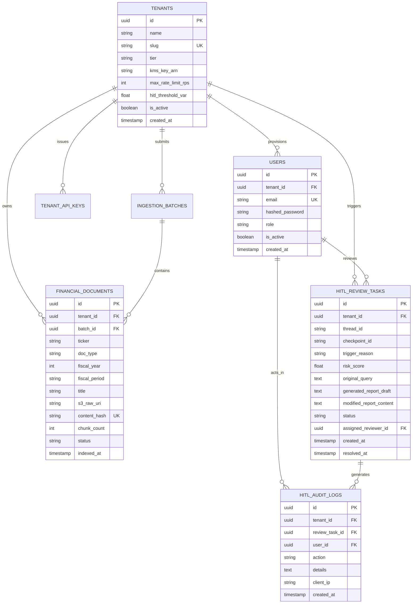

# Enterprise Financial Research & Risk Copilot — Data Architecture

## 1. Data Classification & Storage Tiering

The platform manages data across four distinct operational tiers:

| Tier | Storage Technology | Scale / Volume | Latency SLA | Retention / Lifecycle |
| :--- | :--- | :--- | :--- | :--- |
| **Object Store (Raw Filings)** | Amazon S3 Standard & Glacier | 100M+ documents (~25 TB) | 100–300 ms | Indefinite; lifecycle transitions to Glacier Flexible Archive after 90 days |
| **Vector & Lexical Search** | Amazon OpenSearch 2.x | 1B+ chunks (~32 TB) | < 50 ms | Hot tier (NVMe/gp3) for 3 years; UltraWarm / Cold tier for older filings |
| **Transactional Relational** | Amazon Aurora PostgreSQL Multi-AZ | 10M users, metadata (~500 GB) | < 10 ms | Active operational data; monthly range partitioning on audit logs |
| **In-Memory Cache & State** | Amazon ElastiCache Redis | Active sessions, cache (~39 GiB) | < 2 ms | Ephemeral / TTL-based (60s to 24h) |
| **Immutable Compliance WORM** | Amazon S3 (Object Lock Compliance Mode) | Audit trails (~2 TB/year) | Batch/Audit | 7 years (SEC Rule 17a-4 compliant) |

---

## 2. Entity-Relationship & Relational Data Model



---

## 3. OpenSearch 1B+ Chunk Index Mapping & Sharding Strategy

### 3.1 Index Schema Design
The OpenSearch index `enterprise_financial_chunks_v1` is optimized for dual dense vector and BM25 text operations:

```json
{
  "settings": {
    "index": {
      "number_of_shards": 200,
      "number_of_replicas": 1,
      "knn": true,
      "knn.algo_param.ef_search": 128,
      "refresh_interval": "5s",
      "codec": "best_compression"
    },
    "analysis": {
      "analyzer": {
        "financial_text_analyzer": {
          "type": "custom",
          "tokenizer": "standard",
          "filter": ["lowercase", "financial_stop_words", "snowball"]
        }
      }
    }
  },
  "mappings": {
    "properties": {
      "tenant_id": { "type": "keyword" },
      "document_id": { "type": "keyword" },
      "chunk_id": { "type": "keyword" },
      "ticker": { "type": "keyword" },
      "doc_type": { "type": "keyword" },
      "fiscal_year": { "type": "integer" },
      "fiscal_period": { "type": "keyword" },
      "section_name": { "type": "keyword" },
      "title": { "type": "text" },
      "content": {
        "type": "text",
        "analyzer": "financial_text_analyzer"
      },
      "embedding": {
        "type": "knn_vector",
        "dimension": 1536,
        "method": {
          "name": "hnsw",
          "space_type": "cosinesimil",
          "engine": "faiss",
          "parameters": {
            "ef_construction": 256,
            "m": 24
          }
        }
      },
      "indexed_at": { "type": "date" }
    }
  }
}
```

### 3.2 Shard Management & Index Lifecycle Management (ILM)
- **Primary Shards**: 200 shards $\times$ 60 GB each = 12 TB primary data.
- **Replica Shards**: 200 replica shards = 12 TB replica data.
- **Index Rollover Policy**:
  - Chunks for historical filings ($> 3$ years old) rollover to monthly cold indices stored on **UltraWarm storage** (S3-backed nodes), reducing cluster compute costs by 65% while retaining searchability.

---

## 4. Financial Document Ingestion & Chunking Pipeline

Financial documents cannot be split using naive fixed-character chunking because balance sheets, income statements, and footnotes lose mathematical semantic meaning when broken arbitrarily.

```
Raw SEC Filing (HTML/PDF)
         │
         ▼
[1. Layout & Table Extraction Engine]
   - Detects financial tables via DOM / OCR bounding boxes
   - Converts tabular statements into structured Markdown & HTML
   - Attaches parent heading context (e.g., "Consolidated Statements of Operations")
         │
         ▼
[2. SEC Section Hierarchical Splitter]
   - Splits on standard regulatory headers:
     Item 1 (Business), Item 1A (Risk Factors), Item 7 (MD&A), Item 8 (Financials)
   - Sliding window chunking (500 tokens with 75-token overlap)
         │
         ▼
[3. Metadata Injection & Deduplication]
   - Injects document header metadata into chunk body:
     "[Filing: 10-K | Ticker: AAPL | Period: FY2024 | Section: Item 7 MD&A]"
   - Generates SHA-256 chunk hash to prevent duplicate vectors
         │
         ▼
[4. Bedrock Titan Batch Embedding Generator]
   - Batch size: 64 chunks per API invocation
   - Normalizes vector to unit length (L2 norm = 1.0) for cosine distance
         │
         ▼
[5. OpenSearch Bulk Indexer]
   - Executes `_bulk` indexing with `routing=tenant_{tenant_id}`
```

---

## 5. Data Retention, Archival & Purging Policies

1. **Transactional Data (Aurora PostgreSQL)**:
   - Tenant accounts, users, and document catalogs are retained indefinitely during active client subscriptions.
   - Upon tenant offboarding, an automated cryptographic erasure process purges data keys from AWS KMS, rendering all data unrecoverable within 24 hours (compliant with GDPR Article 17).
2. **Audit & Compliance Logs**:
   - Written to S3 Object Lock buckets with legal hold retention of 7 years.
   - Deletion is mathematically prevented by AWS IAM and S3 Compliance Mode controls.
3. **Cache Invalidation**:
   - Redis semantic cache entries expire after 24 hours to ensure financial research incorporates fresh earnings reports and market data updates.
