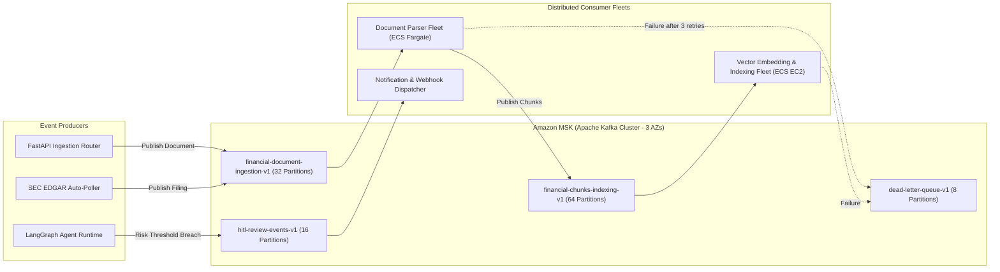

# Enterprise Financial Research & Risk Copilot — Event-Driven Architecture

## 1. Principles & Event-Driven Topology

To maintain system responsiveness under 10,000 API RPS and asynchronous workloads (100M+ documents and multi-step agent reasoning), all long-running, CPU-intensive, or I/O-heavy operations are decoupled via an **event-driven architecture using Apache Kafka (Amazon MSK)**.



---

## 2. Topic Taxonomy, Partitioning & Retention

| Topic Name | Purpose | Partition Key | Partitions | Retention | Max Msg Size |
| :--- | :--- | :--- | :---: | :--- | :--- |
| `financial-document-ingestion-v1` | Raw document processing trigger | `tenant_id:ticker` | 32 | 7 days | 10 MB |
| `financial-chunks-indexing-v1` | Chunks ready for vector embedding | `tenant_id:doc_id` | 64 | 3 days | 1 MB |
| `hitl-review-events-v1` | HITL interrupt task creation & resume | `tenant_id:thread_id` | 16 | 30 days | 256 KB |
| `risk-alerts-v1` | Portfolio risk policy threshold breaches | `tenant_id:portfolio_id`| 16 | 14 days | 256 KB |
| `dead-letter-queue-v1` | Unrecoverable failed processing events | `event_id` | 8 | 30 days | 10 MB |

---

## 3. Event Payloads & Schema Definitions

All events are strictly validated against JSON Schemas with backward and forward compatibility rules.

### 3.1 `DocumentIngestedEvent`
```json
{
  "event_id": "evt-883a-49c1",
  "event_type": "DOCUMENT_INGESTED",
  "timestamp": "2026-10-07T14:30:00Z",
  "tenant_id": "7f8a-4b2c-91d0",
  "correlation_id": "corr-c72e-44b2",
  "payload": {
    "document_id": "doc-5521-9988",
    "ticker": "AAPL",
    "doc_type": "10-K",
    "fiscal_year": 2024,
    "fiscal_period": "FY",
    "s3_raw_uri": "s3://enterprise-financial-filings/7f8a/AAPL/2024/10K.htm",
    "content_hash": "e3b0c44298fc1c149afbf4c8996fb92427ae41e4649b934ca495991b7852b855",
    "file_size_bytes": 12850400
  }
}
```

### 3.2 `DocumentChunksReadyEvent`
```json
{
  "event_id": "evt-991b-12d4",
  "event_type": "CHUNKS_READY_FOR_EMBEDDING",
  "timestamp": "2026-10-07T14:30:15Z",
  "tenant_id": "7f8a-4b2c-91d0",
  "correlation_id": "corr-c72e-44b2",
  "payload": {
    "document_id": "doc-5521-9988",
    "batch_index": 1,
    "total_batches": 4,
    "chunk_count": 64,
    "chunks": [
      {
        "chunk_id": "chk-001",
        "section_name": "Item 1A - Risk Factors",
        "text": "The company's operations are subject to macroeconomic volatility...",
        "token_count": 485
      }
    ]
  }
}
```

### 3.3 `HITLReviewRequestedEvent`
```json
{
  "event_id": "evt-441c-33e9",
  "event_type": "HITL_REVIEW_REQUESTED",
  "timestamp": "2026-10-07T14:31:00Z",
  "tenant_id": "7f8a-4b2c-91d0",
  "correlation_id": "corr-d81a-99f1",
  "payload": {
    "task_id": "tsk-7721-3344",
    "thread_id": "thread-1289-4451",
    "checkpoint_id": "chkpt-9921",
    "trigger_reason": "HIGH_RISK_THRESHOLD",
    "risk_score": 7.45,
    "summary": "Simulated portfolio VaR of 7.45% breaches 5.0% institutional threshold."
  }
}
```

---

## 4. Consumer Semantics, Idempotency & Failure Handling

### 4.1 At-Least-Once Delivery with Idempotent Deduplication
Kafka guarantees at-least-once message delivery. To prevent duplicate vector indexing:
1. Every consumer checks the target entity in PostgreSQL or Redis using a deterministic key before processing.
2. The `FinancialDocument` model enforces a unique index on `(tenant_id, content_hash)`. Duplicate document events are acknowledged and discarded without re-processing.
3. OpenSearch document IDs are deterministic: `doc_id = SHA256(tenant_id + chunk_id)`. Re-indexing the same chunk operates as an idempotent upsert.

### 4.2 Retry Policy & Dead Letter Queue (DLQ)
- **Transient Failures (HTTP 429, Network Blips)**: Handled via exponential backoff with jitter (initial retry 500ms, multiplier 2.0, max 3 retries).
- **Persistent / Poison Pill Failures**: If processing fails after 3 retries, the event is wrapped with error stack traces and routed to `dead-letter-queue-v1`.
- Alerts fire in Amazon CloudWatch when DLQ messages exceed 5 in a 15-minute window.
