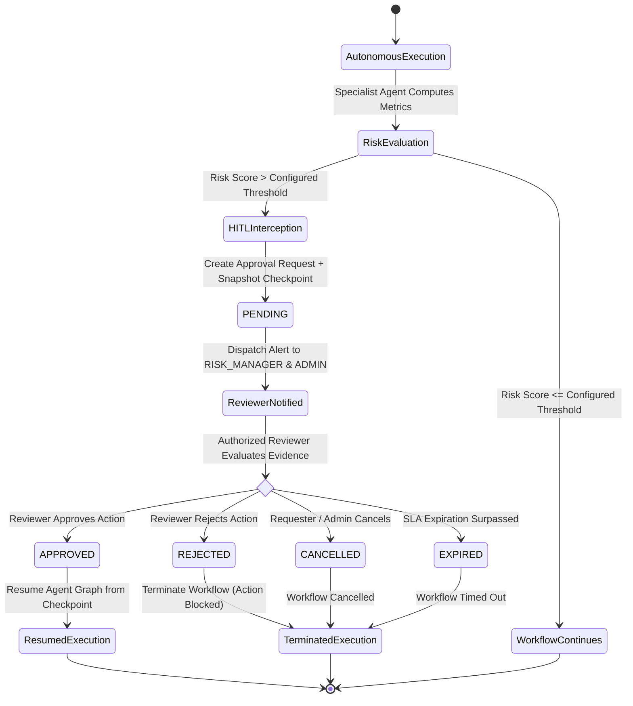

# Human-in-the-Loop (HITL) Workflow Architecture

## 1. Executive Summary

Financial research and risk copilots handle high-stakes institutional operations: quantitative Value-at-Risk calculations, portfolio stress-testing, large capital rebalancing, and regulatory limit overrides. Unchecked autonomous execution in these scenarios introduces systemic fiduciary and operational risks.

The **Human-in-the-Loop (HITL) Workflow Engine** implements an auditable safety architecture that intercepts high-impact operations when risk thresholds are breached, pauses multi-agent graph execution, dispatches real-time alerts to authorized Senior Risk Officers, and safely resumes or terminates execution upon human decision.

---

## 2. End-to-End Workflow & State Machine



---

## 3. Approval Request Schema

Every approval request encapsulates the complete operational and provenance context required for an institutional risk officer to evaluate the proposed action without ambiguity:

| Attribute | Type | Description |
| :--- | :--- | :--- |
| `id` / `task_id` | `UUID` | Unique immutable task identifier |
| `tenant_id` | `UUID` | Strict multi-tenant isolation boundary |
| `user_id` | `UUID` | User who initiated the workflow / query |
| `reason` | `Text` | Explicit trigger reason (e.g. VaR 8.25% breached limit 5.00%) |
| `evidence` | `JSON` | Quantitative metrics, duration gaps, asset concentrations |
| `model_output` | `Text` | Synthesized agent analysis and proposed recommendation |
| `confidence` | `Float` | Model confidence score (e.g. 0.96) |
| `proposed_action` | `String` | Action requiring gate approval (e.g. `liquidate_position`, `modify_risk_limits`) |
| `tool_calls` | `JSON` | List of tool executions leading to this assessment |
| `risk_score` | `Float` | Quantitative risk metric triggering review |
| `agent_run_id` | `UUID` | Reference to the associated LangGraph AgentRun |
| `thread_id` | `String` | LangGraph checkpoint thread for state persistence |
| `status` | `Enum` | `PENDING`, `APPROVED`, `REJECTED`, `EXPIRED`, `CANCELLED` |
| `created_at` / `timestamp` | `DateTime`| Immutable creation timestamp |
| `expires_at` | `DateTime`| Optional SLA expiration timestamp |
| `reviewed_by_id` | `UUID` | Reviewer who resolved the task |
| `reviewed_at` | `DateTime`| Decision timestamp |
| `reviewer_decision_notes`| `Text` | Required or optional notes justifying decision |
| `version` | `Integer` | Optimistic concurrency control version counter |

---

## 4. Lifecycle States & Transitions

1. **`PENDING`**:
   - Initial state upon creation.
   - Execution is paused at LangGraph checkpoint; reviewers notified.
2. **`APPROVED`**:
   - Authorized reviewer (`RISK_MANAGER` or `ADMIN`) validated the evidence and approved the action.
   - Triggers `resume_workflow(thread_id, "APPROVED")`.
3. **`REJECTED`**:
   - Authorized reviewer denied the action.
   - Marks workflow permanently halted; action is cancelled.
4. **`CANCELLED`**:
   - Original requester or Administrator voluntarily revoked the request before reviewer resolution.
5. **`EXPIRED`**:
   - Task surpassed its configured SLA deadline (`expires_at < utcnow()`).
   - Prevents stale or out-of-date market orders from being executed.

---

## 5. Security & Governance Guarantees

### 1. Role-Based Approval Authorization (RBAC)
- **Authorized Approver Roles**: `RISK_MANAGER`, `ADMIN`.
- **Denied Roles**: `ANALYST`, `ADVISOR`, `READ_ONLY_USER`.
- Unauthorized approval attempts raise `AuthorizationException` (HTTP 403 Forbidden) and write a `DENIED` security audit event.

### 2. Multi-Tenant Isolation
- All queries, listings, and resolution updates enforce strict `tenant_id` boundaries.
- Cross-tenant approval attempts are rejected with `EntityNotFoundException` (preventing tenant information leakage).

### 3. Duplicate Approval Prevention & Race Condition Defense
- **Optimistic Concurrency Control**:
  ```sql
  UPDATE hitl_review_tasks
  SET status = :new_status,
      reviewed_by_id = :reviewer_id,
      reviewed_at = :now,
      version = version + 1
  WHERE id = :task_id
    AND tenant_id = :tenant_id
    AND version = :expected_version
    AND status = 'PENDING';
  ```
- If two reviewers attempt to approve/reject the same request concurrently, the database atomically updates exactly **one** transaction. The second transaction observes `rowcount == 0` and is rejected with an `OptimisticConcurrencyException` ("Duplicate approval prevented").

### 4. Comprehensive Auditability
- Every state transition generates an immutable record in `audit_events`:
  - `HITL_APPROVAL_REQUEST_CREATED`
  - `HITL_APPROVAL_APPROVED`
  - `HITL_APPROVAL_REJECTED`
  - `HITL_APPROVAL_CANCELLED`
  - `HITL_TASK_EXPIRED`
  - `HITL_UNAUTHORIZED_RESOLUTION_ATTEMPT`

---

## 6. REST API Endpoints

| Method | Path | Required Permission | Description |
| :--- | :--- | :--- | :--- |
| `GET` | `/api/v1/hitl/tasks` | `hitl:review` | Lists pending tasks for caller tenant |
| `POST`| `/api/v1/hitl/tasks` | `conversations:write` | Creates new approval request |
| `GET` | `/api/v1/hitl/tasks/{id}` | `hitl:review` | Returns full request details and evidence |
| `POST`| `/api/v1/hitl/tasks/{id}/resolve` | `hitl:approve` | Resolves task (`APPROVED`, `REJECTED`, `CANCELLED`) |
| `POST`| `/api/v1/hitl/tasks/{id}/action` | `hitl:approve` | Backward-compatible resolution endpoint |
