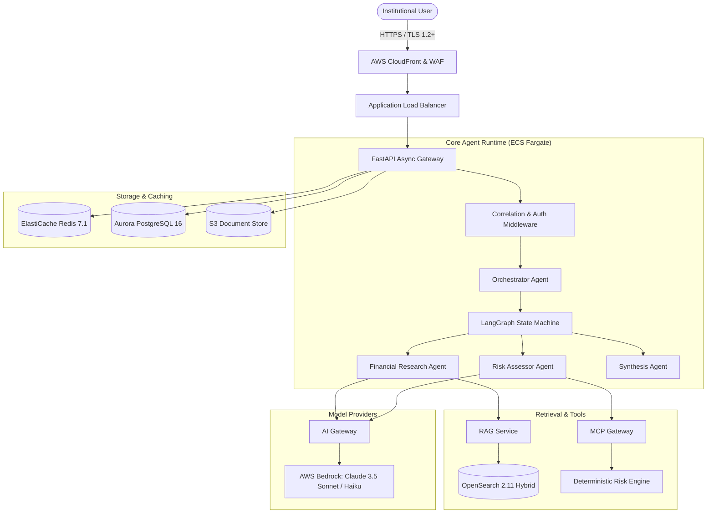

# 02 — Architecture Explanation & System Design

## 1. Architectural Blueprint (9 Core Dimensions)

### 1. What Problem Does It Solve?
Enterprise financial research requires analyzing vast semi-structured financial documents (10-K, 10-Q, 8-K), executing rigorous quantitative risk algorithms (VaR, DCF, liquidity ratios), and maintaining absolute multi-tenant security under SEC/FINRA compliance. Monolithic systems fail to isolate sensitive financial workloads, create unbounded LLM token costs, and cannot provide deterministic audit trails.

### 2. Why Did We Choose This Architecture?
We selected a **decoupled, multi-layered micro-service architecture** composed of:
- **FastAPI Async Ingress**: High-concurrency ASGI web framework with asynchronous SQLAlchemy 2.0 and Redis pools.
- **LangGraph Multi-Agent State Machine**: Deterministic cyclic directed acyclic graphs (DAGs) with state persistence and human-in-the-loop interruption.
- **OpenSearch Hybrid Retrieval**: Native lexical BM25 combined with vector k-NN search and cross-encoder reranking.
- **Model Context Protocol (MCP)**: Decoupled tool layer providing standardized tool schemas and authorization guards.
- **Multi-Tenant Aurora PostgreSQL + Redis**: Relational data integrity for users, tenants, and audit logs with sub-millisecond Redis state caching.

### 3. What Alternatives Were Considered?
- **Monolithic Agent (e.g. AutoGPT / LangChain AgentExecutor)**: Rejected due to nondeterministic looping, high token costs, and lack of fine-grained state persistence.
- **Pure Vector Search (Pinecone / Weaviate / Chroma)**: Rejected because financial queries require exact numerical, ticker, and table token matching (e.g., "Item 1A Risk Factors in FY2023 Form 10-K"), where pure dense embeddings fail without BM25 lexical support.
- **Single Model Direct Prompting**: Rejected because LLMs cannot calculate complex financial metrics deterministically without mathematical hallucination.

### 4. How Does It Work Internally?

### 5. How Does It Scale?
- **Stateless Web/Worker Tier**: ECS Fargate auto-scales from 4 to 50 tasks across 3 AZs based on ALB `RequestCountPerTarget` (1,000 req/task) and latency step scaling.
- **Database Scalability**: Aurora PostgreSQL Serverless v2 dynamically scales from 2.0 to 32.0 ACUs in sub-second increments with an RDS Proxy connection pool absorbing spikes up to 5,000 connections.
- **Retrieval Scalability**: OpenSearch domain uses 3 data nodes with dedicated master nodes, sharded across multiple AZs.
- **State & Rate Limiting**: Redis replication group handles 100K+ ops/sec for session tokens and sliding-window rate limit checks.

### 6. What Happens When It Fail?
- **LLM Provider Outage**: The AI Gateway circuit breaker detects Bedrock timeouts (>10s) or 5xx errors, automatically failing over from Claude 3.5 Sonnet to Claude 3.5 Haiku or secondary regional endpoints.
- **OpenSearch Cluster Degradation**: Fallback to direct semantic search cache in Redis or graceful degradation with warning notices to the user.
- **Agent Infinite Loop**: LangGraph node state enforces strict `max_iterations = 10` and `max_tool_calls = 15`. If exceeded, execution halts and returns a structured partial response with a warning.

### 7. How Is It Secured?
- **Multi-Tenant Boundary**: Mandatory `tenant_id` extraction from signed JWT tokens. OpenSearch queries and PostgreSQL queries enforce row-level and filter-level tenant boundaries.
- **KMS Customer Managed Key**: All S3 buckets, SQS queues, Aurora storage, Redis clusters, and EBS volumes are encrypted at rest with automatic annual rotation.
- **Least Privilege IAM**: ECS task execution roles are strictly scoped to specific Bedrock model ARNs, S3 buckets, and KMS keys.

### 8. How Is It Monitored?
- **OpenTelemetry Instrumentation**: Distributed tracing across FastAPI, LangGraph nodes, OpenSearch queries, and LLM calls.
- **CloudWatch Composite Alarms**: Triggered if p95 response time exceeds 1.0s or 5xx error rate exceeds 1%.
- **Zero-Secret Structured Logging**: All logs emitted in JSON format with Correlation IDs (`request_id`, `trace_id`, `tenant_id`, `user_id`, `agent_run_id`).

### 9. What Are the Trade-offs?
- **Latency vs. Accuracy**: Running hybrid retrieval + cross-encoder reranking + multi-agent verification adds ~800ms compared to a naive single-prompt LLM, but eliminates financial hallucinations.
- **Operational Complexity**: Managing Aurora Serverless, OpenSearch, Redis, and LangGraph requires strict infrastructure-as-code and observability compared to an all-in-one SaaS platform.

---

## 2. Spoken Interview Responses

### Interviewer: "Why did you build an AI Gateway rather than calling the LLM directly from the agents?"
**Spoken Response:**
"In an enterprise platform, calling the model SDK directly from business logic is an architectural anti-pattern. If you bind your application code directly to the Anthropic or OpenAI SDK, you create vendor lock-in, lose central observability, and have no way to enforce cost and token budgets.

By placing our custom `AIGateway` (`src/ai_gateway/`) between our agents and Bedrock:
1. **Circuit Breaking and Fallbacks**: If AWS Bedrock experiences transient rate limits (HTTP 429) or regional degradation, the gateway catches the exception and fails over to secondary models or providers transparently without breaking the agent loop.
2. **Semantic Caching**: The gateway computes an embedding hash of incoming prompts and queries ElastiCache Redis. Identical or highly similar financial queries are served in sub-5ms with zero LLM API cost.
3. **Cost and Token Governance**: Every completion tracks input tokens, output tokens, latency, and estimated USD cost, logging them to OpenTelemetry metrics. If a tenant exceeds their monthly token quota, the gateway enforces rate limits before incurring cloud bills."

### Interviewer: "How do you ensure that two different hedge funds using the same platform never see each other's data?"
**Spoken Response:**
"We implement **defense-in-depth tenant isolation** across three distinct layers:
1. **API Ingress Boundary**: The user's JWT token is verified using RS256. The claims contain the immutable `tenant_id`. Our `CorrelationIdMiddleware` sets this in an asynchronous Python `contextvars` store, ensuring every thread and coroutine inherits the tenant context.
2. **Database Isolation**: In PostgreSQL, every entity—from `FinancialDocument` to `HITLTask`—includes a `tenant_id` foreign key. All repository queries require an explicit `where(Entity.tenant_id == tenant_id)` predicate.
3. **Vector / RAG Isolation**: In OpenSearch, we never rely on client-provided filters. Our `TenantBoundaryEnforcer` intercepts the OpenSearch DSL query abstract syntax tree (AST) and injects a mandatory `{"term": {"tenant_id": current_tenant_id}}` filter at the root boolean query level. Even if a user attempts a prompt injection asking the model to retrieve 'documents from Tenant B', the underlying search engine physically cannot return records with another tenant's ID."
