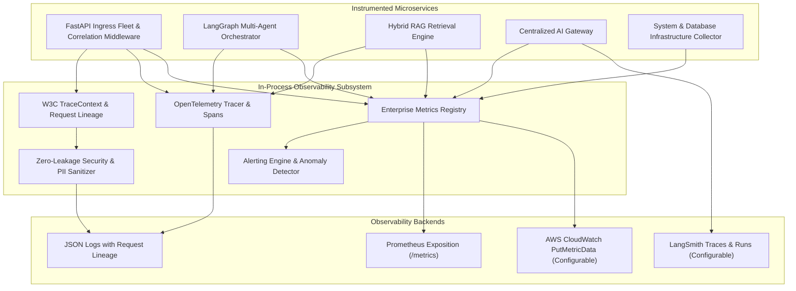

# Enterprise Financial Research & Risk Copilot — Observability & Telemetry (Phase 13)

## 1. Observability Architecture & Standards

Enterprise Observability is implemented using the **OpenTelemetry (OTel)** open standard with zero vendor lock-in, enabling seamless telemetry ingestion into Amazon Managed Prometheus, Amazon CloudWatch, LangSmith, Jaeger, and Datadog.



---

## 2. Request Context Propagation & Distributed Tracing

Every request across the platform supports complete transaction lineage:
- `request_id` / `correlation_id`
- `trace_id` (32-character hexadecimal W3C compliant)
- `tenant_id`
- `user_id`
- `conversation_id`
- `agent_run_id`

### W3C TraceContext Standard
Every HTTP client request receives and propagates standard W3C `traceparent` headers:
```http
traceparent: 00-4bf92f3577b34da6a3ce929d0e0e4736-00f067aa0ba902b7-01
X-Request-ID: req-018f92a3-b4cd-7011-8292-123456789abc
X-Correlation-ID: req-018f92a3-b4cd-7011-8292-123456789abc
X-Trace-ID: 4bf92f3577b34da6a3ce929d0e0e4736
```

### Trace Span Hierarchy
```
HTTP POST /api/v1/copilot/chat [SERVER Span]
  ├── auth.validate_jwt [INTERNAL Span]
  ├── ratelimit.check_bucket [INTERNAL Span]
  ├── rag.hybrid_search [INTERNAL Span]
  │     ├── opensearch.hybrid_query
  │     └── opensearch.vector_knn
  ├── rag.reranker [INTERNAL Span]
  ├── agent.orchestrator [INTERNAL Span]
  │     ├── node.supervisor
  │     ├── node.research_agent
  │     │     └── mcp.tool.search_research
  │     ├── node.risk_agent
  │     │     └── mcp.tool.get_volatility
  │     └── node.synthesizer
  └── llm.bedrock.claude-3-5-sonnet [CLIENT Span]
```

---

## 3. Zero-Leakage Privacy & Financial Data Scrubbing

> [!CAUTION]
> **Zero-Leakage Policy:** Secrets, credentials, and sensitive financial/personal data must NEVER appear in logs or telemetry.

The `src.observability.sanitizer` module provides automatic recursive scrubbing for:
1. **Credentials & Secrets**:
   - Bearer tokens (`Bearer eyJ...`) $\rightarrow$ `[REDACTED_BEARER_TOKEN]`
   - Raw JWT signatures $\rightarrow$ `[REDACTED_JWT]`
   - AWS Access Keys (`AKIA...`) $\rightarrow$ `[REDACTED_AWS_KEY]`
   - Key-value secrets (`api_key`, `secret_key`, `password`, `pwd`) $\rightarrow$ `[REDACTED_SECRET]`
2. **Payment & Financial PII**:
   - Primary Account Numbers (13-19 digit PAN card numbers) $\rightarrow$ `[REDACTED_PAN]`
   - Social Security Numbers (`XXX-XX-XXXX`) $\rightarrow$ `[REDACTED_SSN]`
   - International Bank Account Numbers (IBAN) $\rightarrow$ `[REDACTED_IBAN]`
   - Bank Account / Routing numbers $\rightarrow$ `[REDACTED_ACCOUNT]`

---

## 4. Complete Operational Metrics Catalog

Metrics are tracked continuously in the thread-safe `EnterpriseMetricsRegistry`:

### 4.1 API Golden Signals
- **RPS (Requests Per Second)**: 60-second sliding window rate.
- **P50, P90, P95, P99 Latency (ms)**: Rolling reservoir quantile distribution.
- **Error Rate**: Ratio of HTTP 5xx/4xx responses to total requests.
- **In-Flight Requests**: Active concurrent HTTP request gauge.

### 4.2 Hybrid RAG Retrieval Metrics
- **Retrieval Latency (ms)**: OpenSearch vector + BM25 fusion execution duration.
- **Reranker Latency (ms)**: Cross-encoder semantic score ranking latency.
- **Recall@K**: Proportion of known ground-truth chunks retrieved.
- **Semantic Cache Hit Ratio**: $\frac{\text{Hits}}{\text{Hits} + \text{Misses}}$ intercept efficiency.

### 4.3 Multi-Agent Orchestration Metrics
- **Execution Time (seconds)**: LangGraph state graph completion duration.
- **Iterations**: Number of specialist reasoning loops executed.
- **Tool Calls**: Aggregate volume of MCP tools executed.
- **Success Rate**: Ratio of workflows completing with `APPROVED` validation.
- **Failure Rate**: Ratio of workflows aborted due to budget, timeout, or errors.

### 4.4 LLM Accounting & Performance Metrics
- **Model & Provider**: Dimension labels (e.g. `anthropic.claude-3-5-sonnet`, `bedrock`).
- **Input Tokens & Output Tokens**: Exact prompt and completion token counters.
- **Latency (ms)**: Foundation model API turnaround duration.
- **Cost (USD)**: Dollar expenditure computed using token pricing models.

### 4.5 System & Infrastructure Metrics
- **CPU Utilization (%)**: Host processor usage.
- **Memory (Bytes / %)**: Process RSS and host memory consumption.
- **Queue Depth**: Pending background tasks, worker tasks, and HITL reviews.
- **Database Connection Pool**: Active checked-out connections, pool size, overflow.
- **OpenSearch Latency (ms)**: Health ping and query latency.

---

## 5. Health Checks & Diagnostic Probes

| Route | Probe Purpose | Verification Scope | Status Codes |
| :--- | :--- | :--- | :--- |
| `GET /health` | Basic Health | Service name, version, and environment. | `200 OK` |
| `GET /health/live` | K8s / ECS Liveness | Process run state. | `200 OK` |
| `GET /health/ready` | ALB Readiness | PostgreSQL database and Redis cluster pings. | `200 OK` or `503 Service Unavailable` |
| `GET /health/deep` | Deep Diagnostics | Database pool, Redis, OpenSearch, System CPU/Memory, Queue Depth, and telemetry snapshot. | `200 OK` or `503 Service Unavailable` |
| `GET /metrics` | Prometheus Scrape | Prometheus exposition format `# HELP`, `# TYPE`, and key-value lines. Supports `?format=json`. | `200 OK` |

---

## 6. Enterprise Alerting Engine

The built-in alerting engine monitors metrics against institutional thresholds and manages alert state transitions (`OK` $\rightarrow$ `FIRING` $\rightarrow$ `RESOLVED`):

| Severity | Alert Rule | Trigger Condition | Notification Target |
| :--- | :--- | :--- | :--- |
| **P1 - CRITICAL** | `API_ERROR_RATE_SPIKE` | Error rate $> 1.0\%$ | PagerDuty SRE on-call immediate page |
| **P1 - CRITICAL** | `OPENSEARCH_LATENCY_SPIKE` | OpenSearch P95 latency $> 1000\text{ ms}$ | Database & Storage On-Call |
| **P2 - HIGH** | `API_P99_LATENCY_DEGRADATION` | API P99 latency $> 2000\text{ ms}$ | Auto-scaling alerts & Slack |
| **P2 - HIGH** | `AGENT_FAILURE_RATE_SPIKE` | Agent failure rate $> 15\%$ | AI Platform Engineering |
| **P2 - HIGH** | `HIGH_MEMORY_PRESSURE` | System memory usage $> 90\%$ | Host Infrastructure Team |
| **P3 - MEDIUM** | `QUEUE_DEPTH_BACKLOG` | Pending queue depth $> 50$ items | Operations & Reviewer Team |

---

## 7. CloudWatch & LangSmith Integrations

Managed through `AppSettings` configuration flags:

```bash
# Enable AWS CloudWatch Metrics Exporter
CLOUDWATCH_ENABLED=true
CLOUDWATCH_NAMESPACE=EnterpriseFinCopilot

# Enable LangSmith Tracing
LANGSMITH_ENABLED=true
LANGSMITH_PROJECT=enterprise-fin-copilot
LANGSMITH_API_KEY=lsv2_pt_...
```

- **CloudWatch Exporter**: Generates `MetricDatum` objects compatible with the AWS SDK `PutMetricData` API.
- **LangSmith Exporter**: Captures LLM calls and LangGraph agent runs into LangSmith-compatible run payloads.

---

## 8. Observability REST API Reference

Authenticated endpoints under `/api/v1/observability`:

| Method | Endpoint | Required Permission | Description |
| :--- | :--- | :--- | :--- |
| `GET` | `/api/v1/observability/metrics/summary` | `observability:read` | Returns full categorized metrics snapshot (API, RAG, Agent, LLM, Infrastructure). |
| `GET` | `/api/v1/observability/alerts` | `observability:read` | Lists active and historical alert incidents. |
| `POST` | `/api/v1/observability/alerts/evaluate` | `observability:manage` | Manually triggers an evaluation cycle across all rules. |
| `GET` | `/api/v1/observability/traces` | `observability:read` | Returns recent distributed trace spans in memory. |
| `GET` | `/api/v1/observability/cloudwatch/preview` | `observability:read` | Previews CloudWatch `PutMetricData` payloads. |
| `GET` | `/api/v1/observability/langsmith/runs` | `observability:read` | Retrieves captured LangSmith run traces. |
