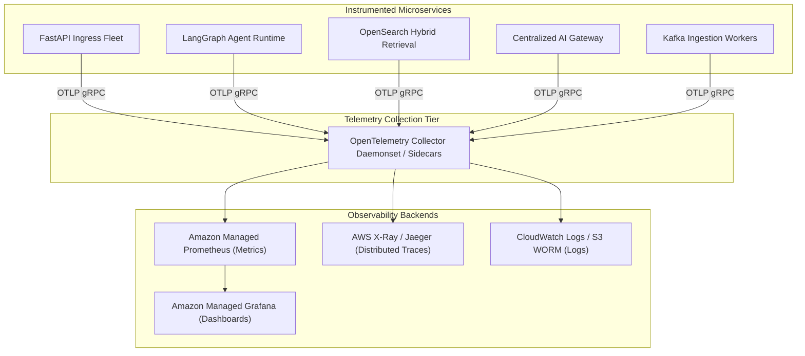

# Enterprise Financial Research & Risk Copilot — Observability & Telemetry

## 1. Observability Architecture & Standards

Observability is implemented using the **OpenTelemetry (OTel)** open standard to avoid vendor lock-in and enable seamless telemetry ingestion into Amazon Managed Prometheus, Amazon CloudWatch, Jaeger, and Datadog.



---

## 2. Distributed Tracing & W3C TraceContext

Every client request is assigned a unique W3C `traceparent` header at CloudFront/ALB, propagated through all downstream systems:
```
traceparent: 00-4bf92f3577b34da6a3ce929d0e0e4736-00f067aa0ba902b7-01
```

### Trace Span Hierarchy for a Financial Copilot Query:
1. `HTTP POST /api/v1/copilot/chat` (FastAPI Server Span)
   - `auth.validate_jwt` (Span)
   - `ratelimit.check_token_bucket` (Redis Span)
   - `ai_gateway.semantic_cache_lookup` (Redis Vector Search Span)
   - `langgraph.workflow_execution` (Agent Runtime Span)
     - `node.router` (Haiku Triage Span)
     - `node.research` (RAG Retrieval Span)
       - `opensearch.hybrid_search` (OpenSearch Client Span)
       - `opensearch.knn_query` (OpenSearch Index Span)
     - `node.risk_model` (Quantitative Calculation Span)
       - `mcp.market_data_quote` (MCP JSON-RPC Span)
     - `node.synthesis` (Sonnet LLM Generation Span)
       - `bedrock.invoke_model` (Bedrock Client Span)
     - `node.guardrails` (Bedrock Guardrail Check Span)
     - `node.hitl_decision` (State Gate Span)

---

## 3. Metrics Catalog & Golden Signals

Metrics are emitted via Prometheus client libraries and scraped every 15 seconds.

### 3.1 Golden Signals & API Metrics
| Metric Name | Type | Labels | Description |
| :--- | :--- | :--- | :--- |
| `http_requests_total` | Counter | `method`, `endpoint`, `status`, `tenant_id` | Total API requests processed (Target: 10K RPS) |
| `http_request_duration_seconds` | Histogram | `endpoint`, `status` | Request latency distribution (P50, P90, P95, P99) |
| `http_active_connections` | Gauge | `protocol` | Active HTTP/2 and WebSocket concurrent connections |
| `rate_limit_exceeded_total` | Counter | `tenant_id`, `tier` | Total HTTP 429 rate limit rejections |

### 3.2 AI Gateway & LLM Metrics
| Metric Name | Type | Labels | Description |
| :--- | :--- | :--- | :--- |
| `ai_gateway_requests_total` | Counter | `model_id`, `tier`, `tenant_id` | Total LLM invocations |
| `ai_gateway_time_to_first_token_seconds` | Histogram | `model_id` | TTFT latency (Target: < 800ms) |
| `ai_gateway_tokens_consumed_total` | Counter | `model_id`, `token_type`, `tenant_id` | Token accounting (`prompt`, `completion`, `embedding`) |
| `ai_gateway_semantic_cache_hits_total` | Counter | `tenant_id` | Semantic cache intercept count (Target: 35%+) |
| `ai_gateway_circuit_breaker_tripped_total` | Counter | `model_id`, `region` | Circuit breaker trips indicating Bedrock instability |

### 3.3 Retrieval & OpenSearch Metrics
| Metric Name | Type | Labels | Description |
| :--- | :--- | :--- | :--- |
| `opensearch_hybrid_search_duration_seconds` | Histogram | `tenant_id` | Query latency across 1B+ chunks (Target: < 50ms) |
| `opensearch_hits_count` | Histogram | `doc_type` | Number of candidate chunks returned per query |
| `opensearch_top_score` | Histogram | `query_type` | Max cosine similarity score returned |

### 3.4 Human-In-The-Loop (HITL) Metrics
| Metric Name | Type | Labels | Description |
| :--- | :--- | :--- | :--- |
| `hitl_tasks_created_total` | Counter | `tenant_id`, `reason` | Total HITL interrupt review tasks created |
| `hitl_tasks_pending_gauge` | Gauge | `tenant_id` | Current queue depth of awaiting review tasks |
| `hitl_review_duration_seconds` | Histogram | `reviewer_role` | Time from interrupt to human resolution |

---

## 4. Alerting Thresholds & PagerDuty Integration

| Severity | Alert Rule | Condition | Action |
| :--- | :--- | :--- | :--- |
| **P1 - CRITICAL** | API Error Rate Spike | HTTP 5xx rate $> 1.0\%$ for 3 mins | PagerDuty SRE on-call immediate page |
| **P1 - CRITICAL** | OpenSearch Node Quorum Loss | Cluster status = RED | Immediate automated cluster restore & SRE page |
| **P2 - HIGH** | P99 API Latency Degradation | P99 latency $> 500\text{ ms}$ for 5 mins | Auto-scale ECS fleet; notify backend engineers |
| **P2 - HIGH** | Bedrock Circuit Breaker Open | AI Gateway failover rate $> 5\%$ for 5 mins | Engage AWS Bedrock TAM / Regional failover |
| **P3 - MEDIUM** | HITL Backlog Queue Buildup | Pending HITL tasks $> 50$ for $> 30$ mins | Slack alert to Senior Risk Officers |
| **P3 - MEDIUM** | Semantic Cache Miss Surge | Cache hit ratio $< 15\%$ over 2 hours | Inspect query distribution drift |
